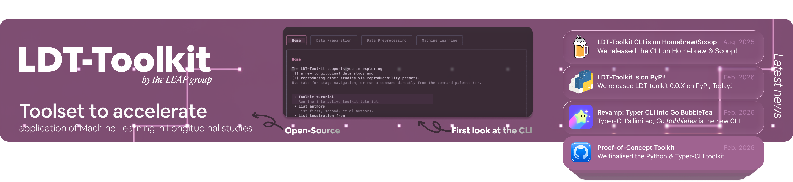

    

# ❝What is LDT Toolkit, in layman's terms?

**LDT Toolkit** (Longitudinal Depression Toolkit) is an open toolkit for building longitudinal mental health workflows that combine data handling, analytics, and reproducible research utilities.

Basically, LDT Toolkit helps researchers and clinical teams organise depression-related data over time and turn it into Ml analyses, without rebuilding the same pipeline pieces from scratch.

An `LDT Toolkit` workflow can support structured analysis on repeated patient observations, reducing ad-hoc scripting and improving reproducibility. BTW, share your reproducible scripts so that we build a catalogue / store of reproducible scripts for any given Longitudinal studies!

Anyway, you should start at [ldt-toolkit](https://github.com/Longitudinal-Depression-Toolkit/ldt-toolkit); download the toolkit and the CLI and play with it!
# ❝Come Contribute to LDT Toolkit

_Whatever your domain, your contribution is welcome._

You can contribute in multiple ways:
- add reusable modules and CLI commands
- improve documentation and examples
- contribute tests, benchmarks, and validation utilities
- share study-specific reproducible scripts for longitudinal depression research

If you are getting started, open an issue or discussion in one of the LDT Toolkit repositories and we can help you pick a good first contribution.

>[!IMPORTANT]
> LDT Toolkit is under active development. Interfaces will evolve quickly while we stabilise the ecosystem.

# ❝Research Group

LDT-Toolkit emerged from a ressearch internship at the Lifecourse Epidemiology and Psychiatry Research Group (LEAP) at
the University of Edinburgh (UK); supervised by [Dr. Alex Kwong](https://edwebprofiles.ed.ac.uk/profile/dr-alex-kwong).

See [LEAP's website](https://life-epi-psych.github.io) for more information about the group and their research.

Cheers! 🥳
